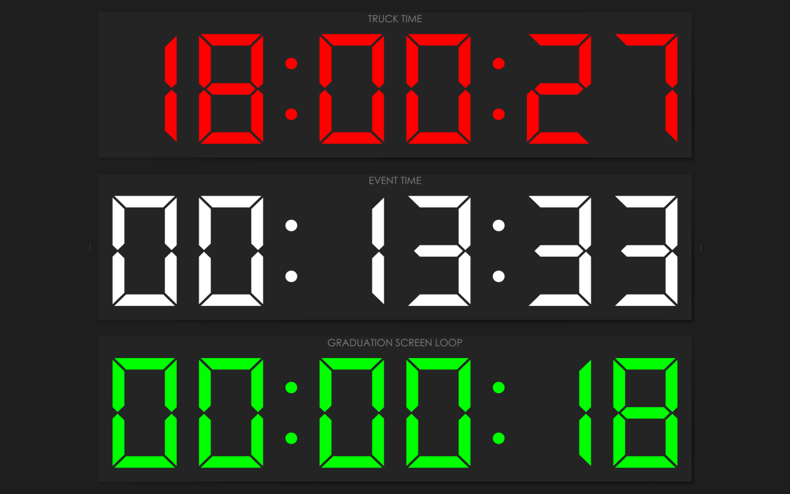

# Timer for CasparCG

This application (the Timer app) is intended to be used in conjunction with CasparCG Server and Client. It displays current time (Truck Time), total event running time (Event Time), and remaining time of the video that's currently playing.

The Timer app is still a bit rough around the corners and has some things hard-coded, but it's usable in its current form and we have been using it in our production environment.

Prerequisites: qt5 and [oscpack](https://github.com/dimitry-ishenko-casparcg/oscpack).

To compile, simply run:

    qmake
    make

Supported options:

    --full    Run in full screen mode
    --blink   Blink current video time in red, when the countdown reaches 30 seconds.

You will need to set up predefined OSC client on the CasparCG Server, eg:

    <osc>
      <predefined-clients>
        <predefined-client>
          <address>192.168.1.123</address>
          <port>7250</port>
        </predefined-client>
      </predefined-clients>
    </osc>

Change the IP address to that of the computer running the Timer app.

If you are running older version of the Server, you can also do it from the CasparCG Frontend. Go to Advanced tab, and click + (the plus sign) under Predefined Clients in the OSC section, enter IP address of the computer running the Timer app and port 7250, go to Status tab and click Restart.

Now, whenever you play a video on channel 1 layer 10, you will see its name and countdown on the bottom panel (Current Video). If the app was launched with `--blink` option, the time will blink in red, when the countdown goes below 30 seconds.

The event running time (Event Time) can likewise be controlled (started, stopped and reset) with OSC messages. This is done from the CasparCG Client. Go to the Settings menu, select OSC tab, click on + (the plus sign) under OSC Output and enter the same IP address and port as above.

Next, add OSC Output item to your rundown. Select the output you have added above from the Output drop-down box. In the Path field enter `/event/status`. In the Message field you can enter one of the following: `reset`, `start` or `stop`. Select `String` from the Type drop-down box.

Now you can control the event time from the rundown in your CasparCG Client.

Lastly, you also have the ability to adjust a few things with the mouse:

* Click on the upper or lower part of the hours, minutes or seconds digits in the Truck Time panel to increment or decrement the current time. Long press on any of the digits will reset any adjustments you've made.

* Click on the middle part of any digit in the Event Time panel to start/stop the event running time. Long press on any digit will reset the event running time to zero. While the event is running, the time can be adjusted similar to the Truck Time.

That's about it.
